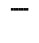

# Data Port Adapter

 

A simple, completely passive board to convert between the slightly different pinouts of the SparkMAX and the SRX Mag Encoder, intended as a way to get a simpler and cheaper absolute encoder option mechanically compatible with the de-facto standard CANCoder.

The STEP file REV-11-2158 (for 3d visualization) is redistributed from REV Robotics and subject to its original licensing.